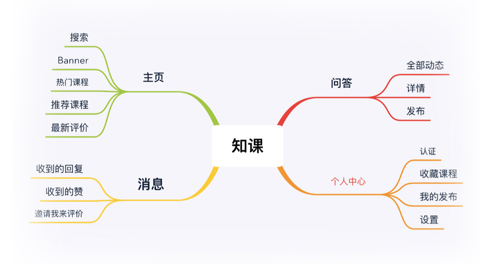
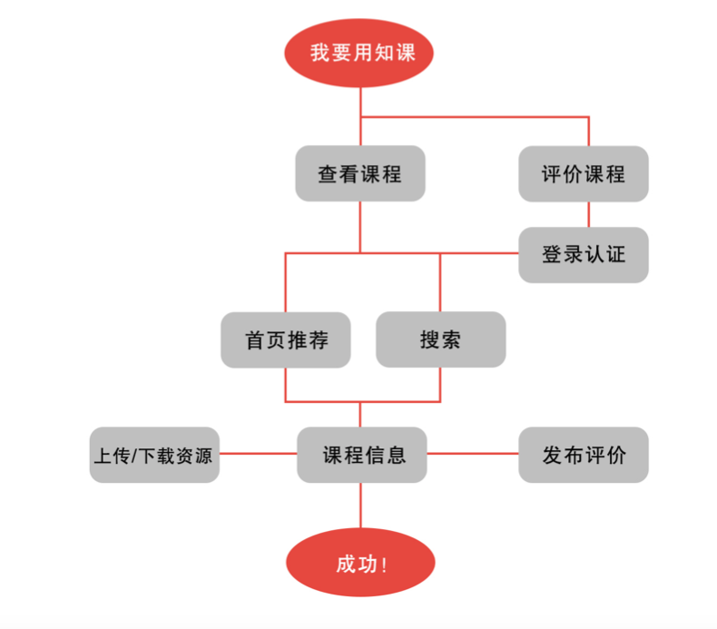

# 知课

## 设计背景

选课是一名大学生进入大学的第一课，旨在选择合适自己的课程。但根据我们的问卷调查统计，78% 的同学在选课过程中存在盲目选课，不知道该选什么课好的问题。

造成这一问题的原因就是，课程信息不对称。

## 产品定位

### 类型

大学生课程评价资源共享小程序

### 特色

学生自主评价交流，课程版的大众点评

### 目标用户

在校大学生

### 使用场景

1. 不知道选什么课合适
2. 不知道选哪位老师
3. 复习时没有对应的学习资源
4. 想要夸赞或吐槽一下某门课程

## 思维导图

## 用户使用流程

